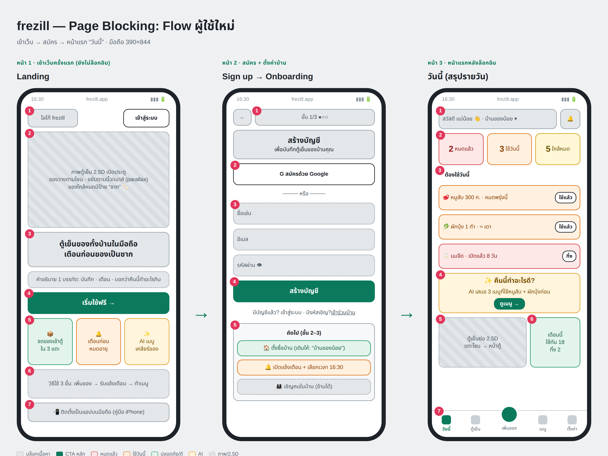

# frezill

เว็บแอป (PWA) ตรวจสอบวัตถุดิบในตู้เย็นของทั้งบ้าน — เตือนก่อนของหมดอายุ และให้ AI เสนอเมนูที่ใช้ของใกล้หมดก่อน

- แผนโปรเจกต์: [`PROJECT_PLAN.md`](PROJECT_PLAN.md)
- กฎการพัฒนา (Claude skill): [`.claude/skills/frezill-dev/SKILL.md`](.claude/skills/frezill-dev/SKILL.md)
- Page blocking: [`docs/blocking/`](docs/blocking/)

Stack: Next.js + Supabase + Gemini + Vercel

## Page Blocking (flow ผู้ใช้ใหม่)



## เริ่มพัฒนา

```bash
cp .env.example .env.local   # ใส่ key ของตัวเอง — ไฟล์ .env* ถูก .gitignore ไว้ ห้าม commit
```
